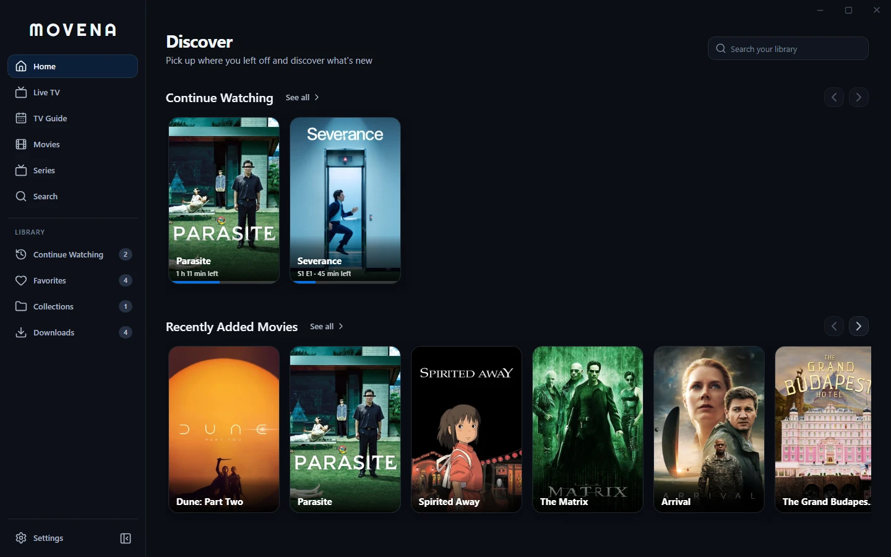
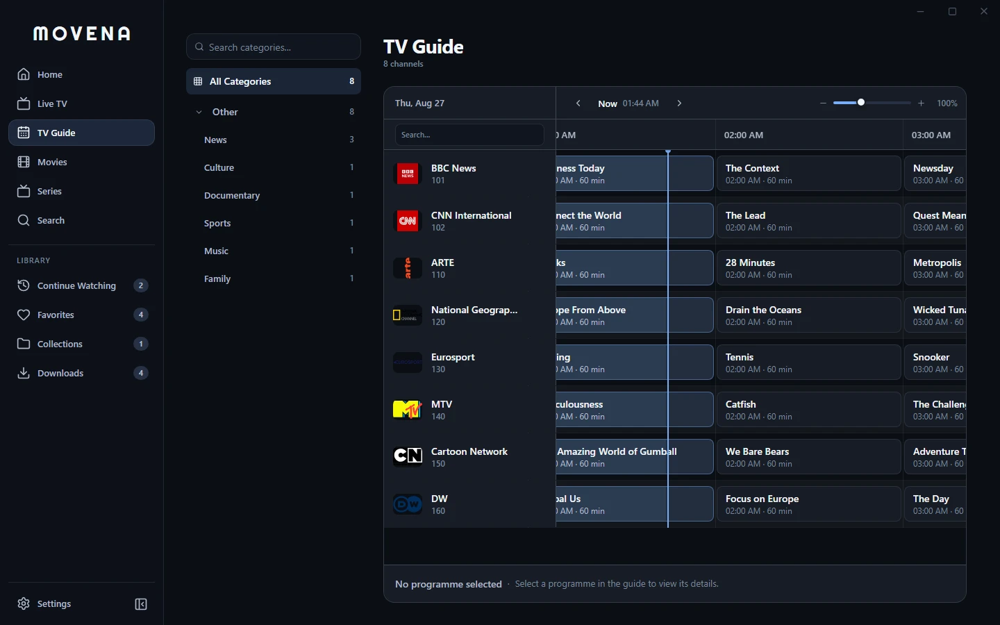
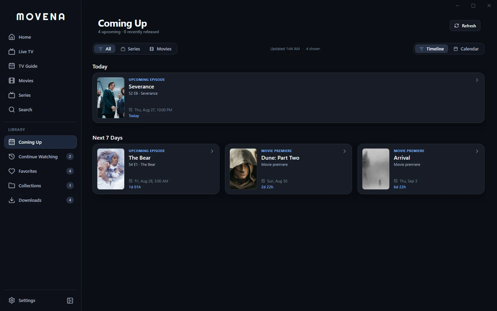
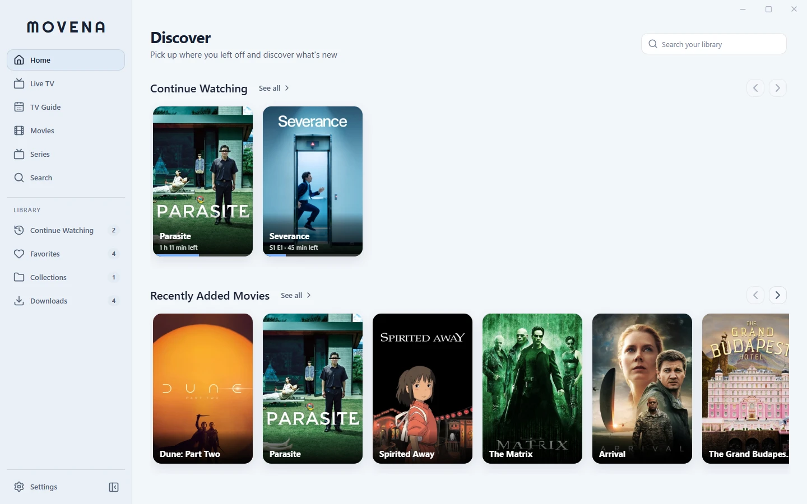

<p align="center">
  
</p>

<h1 align="center">Movena</h1>

<p align="center">
  A private, cross-platform IPTV and VOD desktop player for Xtream Codes and
  M3U/M3U8 playlists, with XMLTV EPG and native libmpv playback.
</p>

<p align="center">
  <a href="https://github.com/movena-app/movena/releases/latest"></a>
  <a href="https://github.com/movena-app/movena/actions/workflows/compliance.yml"></a>
  <a href="https://discord.gg/hRHpwVPjBN"></a>
  <a href="LICENSE"></a>
  
</p>

<p align="center">
  <strong><a href="https://github.com/movena-app/movena/releases/latest">Download</a></strong>
  · <a href="https://apps.microsoft.com/detail/9P2T0QGGHQGQ">Microsoft Store</a>
  · <a href="https://movena.frtx.cc/">Website</a>
  · <a href="https://discord.gg/hRHpwVPjBN">Discord</a>
  · <a href="https://github.com/movena-app/movena/issues">Report an issue</a>
  · <a href=".github/SUPPORT.md">Support</a>
  · <a href=".github/CONTRIBUTING.md">Contribute</a>
</p>

> [!IMPORTANT]
> **Use official sources only.** Movena is a free, open-source player. It does
> not sell or provide subscriptions, channels, playlists, or media. Download it
> only from this repository or the official website.

> [!NOTE]
> Bring your own authorized content. Movena does not bypass DRM; use recording,
> catch-up, and download features only where you have permission.



## Get started

1. [Download the latest Movena release](https://github.com/movena-app/movena/releases/latest) for your desktop platform.
2. Connect an authorized Xtream Codes account or add a local or remote M3U/M3U8 playlist.
3. Browse Live TV, movies, series, and available programme guide data.

Movena keeps sources separate at the credential boundary while presenting their
enabled channels, catalogues, categories, and guides in one workspace.

## Features

**Sources and playlists**

- Connect multiple Xtream Codes and M3U/M3U8 sources at the same time.
- Load playlists from local files or remote URLs, with scheduled background refresh.
- Fold duplicate quality tiers (4K, FHD, HD, RAW, HEVC) of the same live channel into a single entry with automatic stream failover.
- Detect playlist XMLTV metadata or configure a per-source XMLTV override.
- Set source-specific user-agent and referrer headers when required.

**Live TV and programme guide**

- Browse provider or XMLTV guide data with now/next information and a timeline grid.
- Search channels, organize categories, and move between channels without leaving playback.
- Correct distorted 16:9 and 4:3 broadcast logos with smart aspect-ratio detection.
- Play supported provider and M3U catch-up/archive programmes.
- Use a dedicated audio-only interface for playlist entries marked as radio.

**Movies, series, and discovery**

- Browse VOD catalogues, seasons, episodes, recently added media, and upcoming releases.
- Search across Live TV, movies, and series, then filter and sort large catalogues.
- Enable optional TMDB enrichment for localized posters, backdrops, and descriptions.
- Track upcoming movie premieres and TV broadcasts with a monthly release calendar and live second-by-second countdowns backed by TMDB and TVmaze.

**Native playback**

- Play video in-window through native libmpv rather than browser video decoding.
- Open public Twitch live-channel page URLs through the bundled Streamlink 8.5
  resolver. Twitch VODs and clips are not handled by this integration; during
  embedded ad intervals playback waits for the channel stream to resume.
- Configure GPU hardware decoding, demuxer buffer sizes (50–500 MiB), and automatic playback recovery.
- Apply HDR-to-SDR tone-mapping algorithms (BT.2446a, Filmic, Reinhard, Mobius), real-time color controls, custom aspect ratios, and Side-by-Side 3D-to-2D conversion.
- Customize subtitle styling (font size, color, background, outline, screen offset) and adjust audio/subtitle synchronization delays.
- Skip chapter-marked or IntroDB-detected intros and recaps with on-screen prompts or hands-free auto-skip.
- Auto-play next episodes with an interactive countdown and navigate seasons through the in-player drawer.

**Library and offline use**

- Save favorites, custom collections, watch history, and Continue Watching progress locally.
- Download movies and episodes with multi-threaded background transfers (1–8 parallel queues), pause, resume, retry, and file reveal.
- Record live TV streams directly to the system Downloads folder with sandboxed path validation.

**M3U workspace**

- Edit playlists through structured channel tables or the raw syntax-highlighted document.
- Batch-clean titles, find and replace values, renumber entries, and manage categories.
- Validate playlist syntax and probe stream health in the background without exposing connection secrets.
- Undo and redo edits, recover local drafts, review changes, export copies, and restore saved versions.

**Privacy and personalization**

- Keep passwords and connection secrets in the operating-system credential vault.
- Use Movena without a project-operated account, advertising, analytics, or telemetry.
- Choose English, German, Spanish, French, Italian, Dutch, Polish, or Brazilian Portuguese.
- Customize accent, catalogue layout, motion, playback, subtitle, picture, and notification settings.
- Export portable preferences without credentials, playlist URLs, history, favorites, or cached media.
- Check for and install signed Movena updater packages from GitHub Releases.

## Product tour

These are browser captures of Movena's production React pages, shared
components, CSS modules, and application shell at 1440×900—not recreated
mockups. The movie and series surfaces use real titles, factual TMDB metadata,
and TMDB poster/backdrop artwork. Live TV uses real channel identities and
official channel marks; programme times remain deterministic example XMLTV
data. Provider accounts, stream URLs, downloads, and playback state use
reserved `.test` fixture data. No commercial video is included.

|                                                                Live TV catalogue                                                                |                                                          Timeline programme guide                                                           |
| :---------------------------------------------------------------------------------------------------------------------------------------------: | :-----------------------------------------------------------------------------------------------------------------------------------------: |
|                                           |                      |
|                                                       Movie details and playback actions                                                        |                                                         Seasons and episode browser                                                         |
|                  |           |
|                                                            Upcoming release calendar                                                            |                                                              Light appearance                                                               |
|                                                    |                                                    |
|                                                               VOD player controls                                                               |                                                    Series playback & episode navigation                                                     |
|  |                                       |
|                                                          M3U visual channel workspace                                                           |                                                            M3U raw syntax editor                                                            |
|                 |                            |
|                                                                 Download queue                                                                  |                                                              Source management                                                              |
|                        |                                           |
|                                                              Global library search                                                              |                                                           Playback configuration                                                            |
|                              |  |

## Download and platform support

Download the current packages from the
[latest release](https://github.com/movena-app/movena/releases/latest). Release
assets also include a
[SHA-256 checksum file](https://github.com/movena-app/movena/releases/latest/download/SHA256SUMS.txt),
an SPDX SBOM, GitHub build-provenance attestations, and updater signatures where
applicable. Platform trust status remains explicitly disclosed below.

| Platform            | Published packages                                                                                              | Important notes                                                                                                                          |
| ------------------- | --------------------------------------------------------------------------------------------------------------- | ---------------------------------------------------------------------------------------------------------------------------------------- |
| Windows x64         | [Microsoft Store](https://apps.microsoft.com/detail/9P2T0QGGHQGQ), WinGet, NSIS `.exe`, `.msi`, portable `.zip` | Microsoft Store / WinGet (`winget install movena`). Standalone NSIS and portable packages bundle libmpv.                                 |
| macOS Apple Silicon | `.dmg` (`aarch64`)                                                                                              | Install the current mpv runtime with `brew install mpv`. Current builds are ad-hoc signed rather than Developer ID notarized.            |
| macOS Intel         | `.dmg` (`x86_64`)                                                                                               | Install the current mpv runtime with `brew install mpv`. Current builds are ad-hoc signed rather than Developer ID notarized.            |
| Linux x64           | `.deb`, `.AppImage`                                                                                             | A compatible system libmpv and normal Tauri/WebKit desktop libraries are required. Install `mpv` through your distribution if necessary. |

If installation or playback fails, search the
[existing issues](https://github.com/movena-app/movena/issues) before opening a
new report. Never include credentials, playlist URLs, provider responses, or
real viewing data in an issue.

<details>
<summary><strong>Keyboard shortcuts</strong></summary>

| Area       | Shortcut                             | Action                                                         |
| ---------- | ------------------------------------ | -------------------------------------------------------------- |
| Navigation | <kbd>Ctrl/Cmd</kbd> + <kbd>1–5</kbd> | Open Home, Live TV, TV Guide, Movies, or Series                |
| Navigation | <kbd>Ctrl/Cmd</kbd> + <kbd>K</kbd>   | Open Search                                                    |
| Navigation | <kbd>Ctrl/Cmd</kbd> + <kbd>\</kbd>   | Collapse or expand the sidebar                                 |
| Help       | <kbd>?</kbd>                         | Show or hide the in-app shortcut guide                         |
| Playback   | <kbd>Space</kbd> or <kbd>K</kbd>     | Play or pause                                                  |
| Playback   | <kbd>F</kbd>                         | Toggle fullscreen                                              |
| Playback   | <kbd>M</kbd>                         | Mute or restore volume                                         |
| Playback   | <kbd>←</kbd> / <kbd>→</kbd>          | Seek backward or forward during VOD playback                   |
| Playback   | <kbd>↑</kbd> / <kbd>↓</kbd>          | Adjust volume, or change channels when the live drawer is open |
| Playback   | <kbd>Esc</kbd>                       | Close the active player menu, drawer, or player                |

</details>

## Technology

| Layer                       | Technology                                      |
| --------------------------- | ----------------------------------------------- |
| Desktop shell               | [Tauri 2](https://tauri.app/)                   |
| Interface                   | React, TypeScript, Zustand, and TanStack Query  |
| Native core                 | Rust                                            |
| Playback                    | [libmpv](https://mpv.io/)                       |
| Twitch live-page resolution | [Streamlink 8.5](https://streamlink.github.io/) |

React owns presentation and client state; Rust owns native playback,
credential storage, filesystem access, downloads, and native cache/network
operations. See [docs/ARCHITECTURE.md](docs/ARCHITECTURE.md) for the full
boundary and repository map.

## Build from source

You will need Node.js 20.19+, npm, Rust, Python 3.13.11, the
[Tauri 2 prerequisites](https://v2.tauri.app/start/prerequisites/), and libmpv
development/runtime files.

```bash
git clone https://github.com/movena-app/movena.git
cd movena
npm install
npm run setup:twitch
```

`setup:twitch` creates an architecture-specific bundled resolver from the
hash-pinned Python dependency lock. `npm run dev` also runs this setup before
starting Tauri.

On macOS:

```bash
xcode-select --install
brew install mpv
```

On Windows, install Visual Studio C++ Build Tools and the Windows SDK, then
provision the pinned development copy of mpv:

```powershell
npm run setup:mpv
```

On Linux, install the Tauri prerequisites and your distribution's libmpv
development package. Then start Movena:

```bash
npm run dev
```

## Contributing

Contributions are welcome. Before submitting a change:

```bash
npm run check
npm run check:licenses
```

Every commit needs a DCO sign-off created with `git commit -s`. Please read
[Contributing guide](.github/CONTRIBUTING.md),
[docs/ARCHITECTURE.md](docs/ARCHITECTURE.md), and
[docs/DESIGN_SYSTEM.md](docs/DESIGN_SYSTEM.md) before substantial changes.
Project direction is documented in the [roadmap](docs/ROADMAP.md).

## Project information

Movena keeps app data local and operates no media proxy or project account.
Read the [privacy documentation](docs/PRIVACY.md) and
[security policy](.github/SECURITY.md) for data handling and private vulnerability
reporting.

Movena is licensed under [GPL-3.0-or-later](LICENSE). Packaging and distribution
requirements are documented in [docs/RELEASING.md](docs/RELEASING.md).
See [CHANGELOG.md](CHANGELOG.md) for unreleased and tagged product changes.
Third-party notices and asset provenance are in
[docs/THIRD_PARTY_NOTICES.md](docs/THIRD_PARTY_NOTICES.md),
[THIRD_PARTY_LICENSES.txt](THIRD_PARTY_LICENSES.txt), and
[docs/ASSETS.md](docs/ASSETS.md). See the
[Code of Conduct](.github/CODE_OF_CONDUCT.md) and
[trademark guidance](docs/TRADEMARK.md) for community and branding terms.
